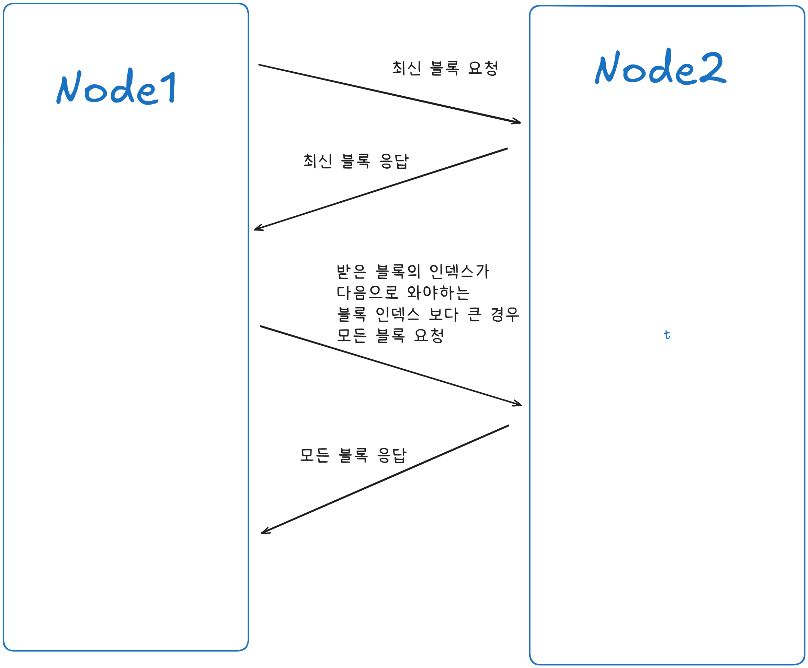

# Simple Blockchain

블록체인 원리 학습을 위한 간결하고 단순한 블록체인

## 블록체인이란?

블록의 해시로 연결된 블록을 순차적으로 쌓아가는 분산형 데이터베이스.

### 블록

여러 거래(또는 기록)를 일정한 단위로 묶어 놓은 데이터 집합.
블록체인의 블록에는 자신의 해시값과 이전 블록의 해시값을 데이터로 가지고 있다.

```ts
interface Block {
  previousHash: string; // 이전 블록의 해시 값
  index: number; // 인덱스
  timestamp: number; // 생성 시간
  data: string; // 담고 싶은 데이터
  hash: string; // 해당 블록의 해시값
}
```

#### 제네시스 블록

블록체인에 첫번째로 생성된 블록을 제네시스 블록이라고 한다.
하드 코딩으로 생성한다.

### 해시

데이터를 일정한 길이의 고정된 문자열로 변환하는 암호학적 함수.

- 같은 입력은 항상 같은 출력
- 입력값이 조금만 달라져도 출력값도 완전히 달라짐
- 출력값으로 입력값을 알아낼 수 없음.(단방향성)

```ts

calculateHash(
    index: number,
    previousHash: string,
    timestamp: number,
    data: string
): string => {
    return CryptoJS.SHA256(index + previousHash + timestamp + data).toString();
}

```

```ts
interface Block {
  previousHash: string;
  index: number;
  timestamp: number;
  data: string;
  // calculateHash(index,previousHash,timestamp,data)
  hash: string;
}
```

### 체인

각 블록이 이전 블록의 해시값을 포함하고 있기 때문에, 마치 **사슬(체인)**처럼 끊어지지 않고 연결된다.

### 분산형 데이터베이스

한 곳(서버)에만 데이터를 저장하지 않고, 여러 위치(노드, 서버)에 분산해서 저장·관리하는 데이터베이스.


## Architecture

### BlockChain


### Connection




## [블록 체인 Flow](./docs/flow.md)

### 1. 블록 생성 및 전파 FLOW

#### 1.1 node1과 node2 연결된 상황


#### 1.2 node1에서 블록 생성 후 전파


#### 1.3 node2에서 블록 받은 후 체인에 추가


### 2. 새로운 노드 연결 FLOW

#### 2.1 node3 node2 연결하고 최신 블록 요청


#### 2.2 받은 블록의 index가 클 경우 전체 체인 요청


#### 2.3 받은 블록체인이 자신보다 길고 유효한지 검사 후 체인 교체


### 3. 충돌 상황(Fork)

#### 3.1 같은 index의 블록이 동시에 생성된 상황


#### 3.2 node1의 index4 블록을 받은 node2는 아무것도 하지 않는다.


#### 3.3 node3이 새로운 블록을 생성하여 node2가 받고 node1에게 전달, node1은 바로 체인에 추가할 수 있는 블록이 아니기 때문에 전체 체인 요청


#### 3.4 node1은 node2에게 전체 체인 요청을 받고 더 긴 체인을 선택


node1이 생성한 블록 4는 소실된다. 이러한 블록을 고아 블록이라고 한다. 비트코인의 경우 고아 블록 안에 들어 있던 트랜잭션은 다시 미확인 거래 풀(memPool)로 돌아가 이후에 처리 된다.

#### 3.5 결과


## 블록체인 핵심 기능 구현

```ts
class BlockchainNode {
  // 블록체인 배열
  private blockchain: Block[] = [this.getGenesisBlock()];
  // 연결된 노드(웹소켓 사용)
  private sockets: WebSocket[] = [];
}
```

### 웹소켓

```ts
initP2PServer(): void {
    const server = new WebSocket.Server({ port: P2P_PORT });

    // 다른 노드가 연결해 온 경우
    server.on("connection", (ws: WebSocket) => {
      console.log("connected", ws);
        // 연결된  노드에 추가
        this.sockets.push(ws);
        // 에러 및 메시지 받았을 경우 handler
        this.initMessageHandler(ws);
        this.initErrorHandler(ws);
        // 연결된 노드에게 최신 블록 정보 요청
        this.write(ws, this.queryChainLengthMsg());
    });
    console.log("listening websocket p2p port on: " + P2P_PORT);
}
```

### 제네시스 블록 하드 코딩

```ts
getGenesisBlock(): Block {
    return {
      index: 0,
      previousHash: "0",
      timestamp: 1756716811615,
      data: "Let there be a block",
      hash: "38cdd2a4bdf21856e32e440da4ade0441e5b327f87981fe18dc63c4e1f0a2db6",
    };
}
```

### 블록 생성

```ts
generateNextBlock(blockData: string): Block {
    const previousBlock = this.getLatestBlock(); // 기장 최신 블록 가져오기
    const nextIndex = previousBlock.index + 1;
    const nextTimestamp = Date.now();
    const nextHash = this.calculateHash(
      nextIndex,
      previousBlock.hash,
      nextTimestamp,
      blockData
    );

    return {
      index: nextIndex,
      previousHash: previousBlock.hash,
      timestamp: nextTimestamp,
      data: blockData,
      hash: nextHash,
    };
  }
```

### 전파하기

```ts
broadcast(message: Message): void {
    this.sockets.forEach((ws) => ws.send(JSON.stringify(message)));
}
```

### 전파받기

```ts
handleBlockchainResponse(message: Message): void {
  // 메시지에 데이터가 없으면 함수 종료
  if (!message.data) return;
  const receivedBlocks: Block[] = JSON.parse(message.data).sort(
    (b1: Block, b2: Block) => b1.index - b2.index
  );
  // 수신된 블록 중 가장 마지막 블록
  const latestBlockReceived = receivedBlocks[receivedBlocks.length - 1];
  // 현재 가지고 있는 블록체인의 가장 마지막 블록
  const latestBlockHeld = this.getLatestBlock();

  // 수신된 마지막 블록의 인덱스가 현재 블록의 마지막 블록 인덱스보다 클 경우 (체인이 더 길 경우: 노드가 뒤처졌을 가능성을 시사)
  if (latestBlockReceived.index > latestBlockHeld.index) {
    console.log(
      `blockchain possibly behind. We got: ${latestBlockHeld.index} Peer got: ${latestBlockReceived.index}`
    );
    // 현재 마지막 블록의 해시가 수신된 마지막 블록의 이전 해시와 일치하는 경우
    if (latestBlockHeld.hash === latestBlockReceived.previousHash) {
      console.log("We can append the received block to our chain");
      // 수신된 블록을 현재 블록체인에 추가
      this.blockchain.push(latestBlockReceived);
      // 새로운 마지막 블록을 다른 피어들에게 전파
      this.broadcast(this.responseLatestMsg());
    } else if (receivedBlocks.length === 1) {
      // 수신된 블록이 하나뿐이고, 이전 해시가 일치하지 않는다면
      console.log("We have to query the chain from our peer");
      // 많이 뒤쳐져 있을 가능성 시사 체인 전체를 요청
      // 전체 체인 정보를 요청하는 메시지를 전파
      this.broadcast(this.queryAllMsg());
    } else {
      // 수신된 블록체인이 현재 블록체인보다 길고, 이전 해시가 일치하지 않는 경우
      console.log("Received blockchain is longer than current blockchain");
      // 수신된 블록체인으로 현재 블록체인을 교체
      this.replaceChain(receivedBlocks);
    }
  } else {
    // 수신된 블록체인이 현재 블록체인보다 길지 않은 경우
    console.log(
      "received blockchain is not longer than current blockchain. Do nothing"
    );
    // 아무 작업도 수행하지 않음
  }
}
```

### 유효한 블록인지 검사하기

```ts
isValidNewBlock(newBlock: Block, previousBlock: Block): boolean {
    // 인덱스 검사
    if (previousBlock.index + 1 !== newBlock.index) {
      console.log("invalid index");
      return false;
      // 이전 블록의 해시 검사
    } else if (previousBlock.hash !== newBlock.previousHash) {
      console.log("invalid previoushash");
      return false;
      // 해시 검사
    } else if (this.calculateHashForBlock(newBlock) !== newBlock.hash) {
      console.log(
        `invalid hash: ${this.calculateHashForBlock(newBlock)} ${newBlock.hash}`
      );
      return false;
    }
    return true;
  }
```

### 가장 긴 체인 선택하기

```ts
replaceChain(newBlocks: Block[]): void {
    if (
      this.isValidChain(newBlocks) &&
      newBlocks.length > this.blockchain.length
    ) {
      console.log(
        "Received blockchain is valid. Replacing current blockchain with received blockchain"
      );
      this.blockchain = newBlocks;
      this.broadcast(this.responseLatestMsg());
      // 전파하기
    } else {
      console.log("Received blockchain invalid");
    }
}
```

### 노드 제어를 위한 HTTP 서버 설정

노드를 제어하기 위해서 HTTP 서버를 설정. 사용자는 이 서버를 통해 노드에 특정 명령을 내리거나 상태를 변경하는 등의 방식으로 노드를 제어할 수 있다.

```ts
initHttpServer(): void {
    const app = express();
    app.use(express.json());
    // 대쉬보드를 위한 정적 파일 제공
    app.use(express.static(path.join(__dirname, "..", "public")));

    // 블록체인 확인
    app.get("/blocks", (req, res) => {
      res.send(JSON.stringify(this.blockchain));
    });

    // 블록 만들기
    app.post(
      "/mineBlock",
      (req: express.Request<{}, {}, MineBlockRequest>, res) => {
        const newBlock = this.generateNextBlock(req.body.data);
        this.addBlock(newBlock);
        this.broadcast(this.responseLatestMsg());
        console.log("block added: " + JSON.stringify(newBlock));
        res.send("success");
      }
    );

    // 연결된 노드 확인하기

    app.get("/peers", (req, res) => {
      res.send(
        this.sockets.map(
          (s: any) => s._socket.remoteAddress + ":" + s._socket.remotePort
        )
      );
    });

    // 노드 연결하기
    app.post(
      "/addPeer",
      (req: express.Request<{}, {}, AddPeerRequest>, res) => {
        this.connectToPeers([req.body.peer]);
        res.send("success");
      }
    );

    app.listen(HTTP_PORT, () => {
      console.log("Listening http on port: " + HTTP_PORT);
    });
}
```

## 실행

### 1. Docker로 실행하기 (권장)

Docker Compose를 사용하면 3개의 노드로 구성된 블록체인 네트워크를 쉽게 실행할 수 있습니다.

#### 사전 준비

- Docker 및 Docker Compose 설치 필요

#### Docker 네트워크 구성

- **Node 1**: HTTP 포트 3001, P2P 포트 6001
- **Node 2**: HTTP 포트 3002, P2P 포트 6002 (Node 1에 자동 연결)
- **Node 3**: HTTP 포트 3003, P2P 포트 6003 (Node 2에 자동 연결)

#### 실행 단계

1. **프로젝트 클론 및 이동**

```bash
git clone <repository-url>
cd simple-blockchain
```

2. **Docker Compose로 네트워크 시작**

```bash
docker-compose up --build
```

3. **웹 대시보드 접속**


- Node 1: http://localhost:3001
- Node 2: http://localhost:3002
- Node 3: http://localhost:3003

각 노드의 대시보드에서 다음을 확인할 수 있습니다:

- 현재 블록체인 상태
- 연결된 피어 목록
- 새 블록 생성 기능
- 피어 추가 기능

### 2. 로컬에서 직접 실행하기

#### 실행 단계

1. **의존성 설치**

```bash
npm install
```

2. **TypeScript 컴파일**

```bash
npm run build
```

3. **노드 실행 (각각 새로운 터미널에서)**

**방법 1: npm 스크립트 사용 (권장)**

```bash
# 터미널 1 - 첫 번째 노드
npm run node1

# 터미널 2 - 두 번째 노드
npm run node2

# 터미널 3 - 세 번째 노드
npm run node3
```

**방법 2: 환경 변수 직접 설정**

```bash
# 터미널 1
HTTP_PORT=3001 P2P_PORT=6001 npm start

# 터미널 2
HTTP_PORT=3002 P2P_PORT=6002 PEERS=ws://localhost:6001 npm start

# 터미널 3
HTTP_PORT=3003 P2P_PORT=6003 PEERS=ws://localhost:6002 npm start
```

### API 엔드포인트

각 노드는 다음 HTTP API를 제공합니다:

#### 블록체인 조회

```bash
GET /blocks
# 현재 블록체인의 모든 블록 반환
curl http://localhost:3001/blocks
```

#### 새 블록 생성 (마이닝)

```bash
POST /mineBlock
Content-Type: application/json

{
  "data": "블록에 저장할 데이터"
}

# 예시
curl -X POST http://localhost:3001/mineBlock \
  -H "Content-Type: application/json" \
  -d '{"data": "Hello Blockchain!"}'
```

#### 연결된 피어 조회

```bash
GET /peers
# 현재 연결된 피어 목록 반환
curl http://localhost:3001/peers
```

#### 새 피어 추가

```bash
POST /addPeer
Content-Type: application/json

{
  "peer": "ws://호스트:포트"
}

# 예시
curl -X POST http://localhost:3001/addPeer \
  -H "Content-Type: application/json" \
  -d '{"peer": "ws://localhost:6003"}'
```
