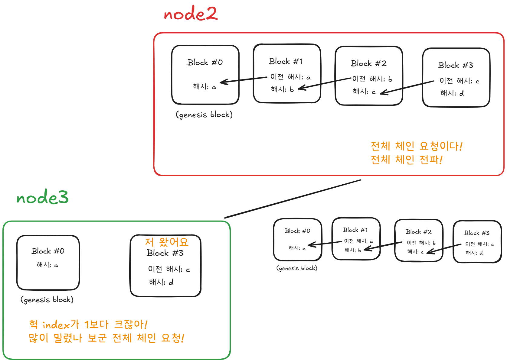
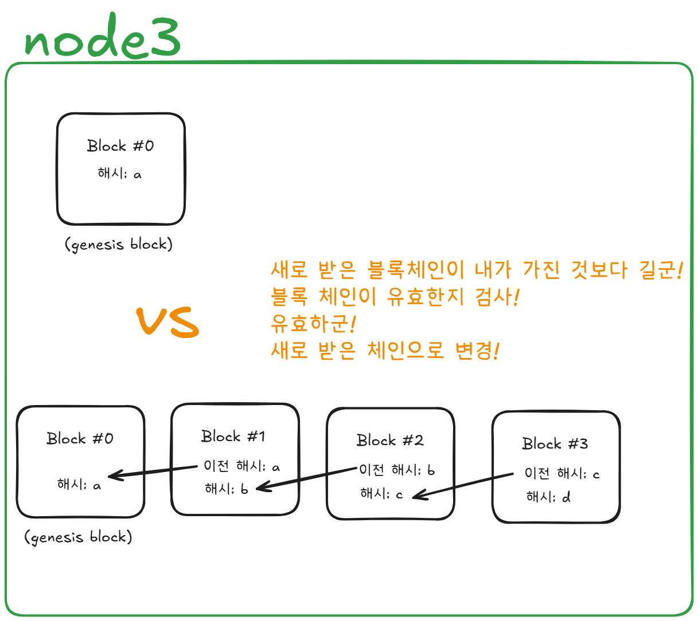
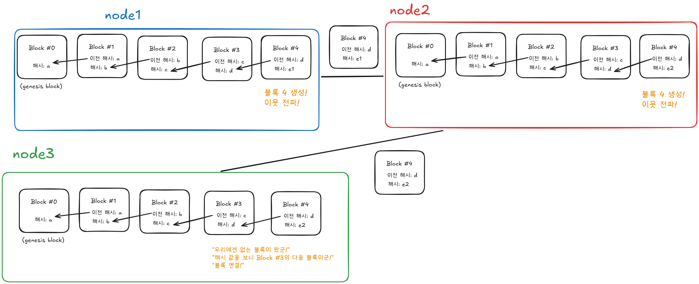
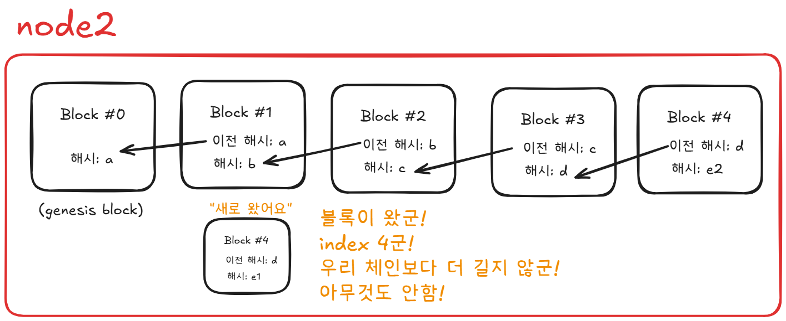
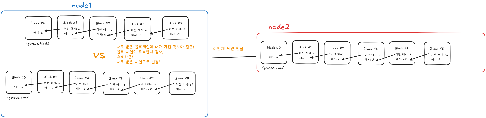

# Simple 블록체인 Flow

## 1. 블록 생성 및 전파 FLOW

### 1.1 node1과 node2 연결된 상황

### 1.2 node1에서 블록 생성 후 전파

### 1.3 node2에서 블록 받은 후 체인에 추가

## 2. 새로운 노드 연결 FLOW

### 2.1 node3 node2 연결하고 최신 블록 요청

### 2.2 받은 블록의 index가 클 경우 전체 체인 요청

### 2.3 받은 블록체인이 자신보다 길고 유효한지 검사 후 체인 교체

## 3. 충돌 상황(Fork)

### 3.1 같은 index의 블록이 동시에 생성된 상황

### 3.2 node1의 index4 블록을 받은 node2는 아무것도 하지 않는다.

### 3.3 node3이 새로운 블록을 생성하여 node2가 받고 node1에게 전달, node1은 바로 체인에 추가할 수 있는 블록이 아니기 때문에 전체 체인 요청

### 3.4 node1은 node2에게 전체 체인 요청을 받고 더 긴 체인을 선택

#### node1이 생성한 블록 4는 소실된다. 이러한 블록을 고아 블록이라고 한다. 비트코인의 경우 고아 블록 안에 들어 있던 트랜잭션은 다시 미확인 거래 풀(memPool)로 돌아가 이후에 처리 된다.

### 3.5 결과

